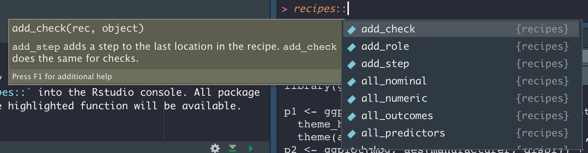

```{r setup, include=FALSE}
knitr::opts_chunk$set(echo = TRUE, message=FALSE, warning=FALSE)
library(tidyverse)
library(tidymodels)
library(janitor)
library(knitr)
library(patchwork)
data("iris")
theme_set(theme_light())
```

## Iris data
The iris dataset is a classic, so much so that it's included in the datasets package that comes with every installation of R. You can use `data()` to see a list of all available datasets. Datasets that are associated with packages can be found in a similar way, e.g., `data(package = 'dplyr')`.

Let's take a look at the data.
```{r}
# load the iris data set and clean the column names with janitor::clean_names()
iris_df<- iris %>% 
  clean_names() 

iris_df %>%  head()

iris_df %>%  count(species)
# equal number of each species, 150 total

iris_df %>%  str()

```
The dataset contains three unique species of iris and four variables or features (sepal length and width, and petal length and width). The data is clean but with only 150 observations it's a wee bit small for training a model. To compensate for this, we will use bootstrap resampling.

#### Outline

**Train a classification model to predict flower species based on the four available features** 

The model formula will have the form `species ~ .` where `.` represents all explanatory variables in the data. 

# Visualize relationships
Before we do any kind of machine learning, it's helpful to visualize the data and develop a better understanding of the variables as well as their relationships. This will also give us a stronger intuitive sense about the potential predictive power of the data. 

```{r}
library(ggforce)

sepal <- iris_df %>% 
  ggplot(aes(sepal_length, sepal_width, color = species)) +
  geom_point(size = 1) + 
  facet_wrap(~species) +
  labs(x = 'sepal length',
       y = 'sepal width') +
  theme(legend.position = 'none') 

petal <- iris_df %>% 
  ggplot(aes(petal_length, petal_width, color = species)) +
  geom_point(size =1) + 
  facet_wrap(~species) +
  labs(x = 'petal length',
       y = 'petal width') +
  theme(legend.position = 'none') 

(petal/sepal) # patchwork allows us to arrange plots side-by-side or stacked 

sl_sw <- iris_df %>% 
  ggplot(aes(sepal_length, sepal_width, color = species)) +
  geom_point(size = 1) +
  labs(x = 'sepal length',
       y = 'sepal width') +
  theme(legend.position = 'none')

sl_sw + 
  geom_mark_hull(
    aes(fill = NULL, label = species),
    concavity = 2) +
  labs(title = "Comparing sepal length vs sepal width across species")

pl_pw <- iris_df %>% 
  ggplot(aes(petal_length, petal_width, color = species)) +
  geom_point(size =1) + 
  labs(x = 'petal length',
       y = 'petal width') +
  theme(legend.position = 'none') 

pl_pw + 
  geom_mark_hull(
    aes(fill = NULL, label = species),
    concavity = 2) +
  labs(title = "Comparing petal length vs petal width across species")


```


Let's change the shape of our data by combining the four iris features into a single column (`metric`) and the associated values will populate a new column (`value`). This transformation into a longer dataset can be achieved with the function `pivot_longer()`.


```{r}
iris_df_long <- iris_df %>%  
  pivot_longer(cols = sepal_length:petal_width,
               names_to = 'metric',
               values_to ='value') 


# A boxplot is a great way to compare the distribution of each features by species.
iris_df_long %>%
  ggplot(aes(species, value, fill = species)) +
  geom_boxplot(alpha = 0.3) +
  facet_wrap(~ metric, scales = "free_y")

# Looking at the data in a different way, geom_density is a nice alternative to geom_histogram.

iris_df_long %>% 
  ggplot(aes(value, fill = species)) +
  geom_density(alpha = .5) +
  facet_wrap(~ metric, scales = "free")

```

## Splitting the data into training and test sets

By default, `initial split()` provides a 75:25 split for our train and test sets respectively. Since our dataset is small to begin with, we are going to  make bootstrap resamples from the training data. The function `bootstraps()` will split the data into training and test sets, then repeat this process with replacement a specified number of times (25 is the default). 

```{r}
set.seed(123)
tidy_split <- initial_split(iris_df)
tidy_split
iris_train <- training(tidy_split)
iris_test <- testing(tidy_split)

iris_boots <- bootstraps(iris_train, times = 30) 
iris_boots
```

## Recipes 
Recipes is a powerful tool with functions for a wide range of feature engineering tasks designed to prepare data for modeling. Typing `recipes::` into the Rstudio console is a great way to browse the available functions in the package. 



Let's create a simple recipe to demonstrate optional feature engineering steps for our numeric data.

```{r}

iris_rec <- recipe(species ~., data = iris_train) %>%
  step_pca(all_predictors()) %>%
  step_normalize(all_predictors())

prep <-  prep(iris_rec)

kable(head(iris_juice <- juice(prep)))
```

## Creating models with **Parsnip** 
Let's set up two different models: first, a **generalized linear model** or **glmnet**. In this step we will create the model, workflow and fit the bootstraps. Let's take a look at the output from each step.

```{r}
# set seed
set.seed(1234)

# generate the glmnet model with parsnip
glmnet_mod <- multinom_reg(penalty = 0) %>% 
  set_engine("glmnet") %>% 
  set_mode("classification")
glmnet_mod

# create a workflow
glmnet_wf <- workflow() %>%
  add_formula(species ~ .) 
glmnet_wf

# add the model to the workflow and use iris_boots to fit our model 25 times
glmnet_results <- glmnet_wf %>%
  add_model(glmnet_mod) %>% 
  fit_resamples(
    resamples = iris_boots,
    control = control_resamples(extract = extract_model,
                             save_pred = TRUE)
    )
glmnet_results

# look at the model metrics
collect_metrics(glmnet_results)
```

Now for a **random forest** model. We only need to change a few things and walah! 

```{r}
set.seed(1234)
rf_mod <- rand_forest() %>%
  set_engine("ranger") %>%
  set_mode("classification")

# We set up a workflow and add the parts of our model together like legos
rf_wf <- workflow() %>%
  add_formula(species ~ .)

# Here we fit our 25 resampled datasets 
rf_results <- rf_wf %>%
  add_model(rf_mod) %>% 
  fit_resamples(
    resamples = iris_boots,
    control = control_resamples(save_pred = TRUE)
    )
collect_metrics(rf_results)
```

Here's a look at the confusion matrix summaries for both models. The confusion matrix let's us see the correct and incorrect predictions of our models in a single table.

```{r}
glmnet_results %>%
  conf_mat_resampled() 

rf_results %>%
  conf_mat_resampled() 
```

The ROC curve helps us visually interpret our model performance at every threshold.

```{r}
glmnet_results %>%
  collect_predictions() %>%
  group_by(id) %>%
  roc_curve(species, .pred_setosa:.pred_virginica) %>%
  autoplot()
```
```{r}
rf_results %>%
  collect_predictions() %>%
  group_by(id) %>%
  roc_curve(species, .pred_setosa:.pred_virginica) %>%
  autoplot() +
  theme(legend.position = 'none')

```

## Final fit

By using the `last_fit(tidy_split)`, we are able to train our model on the training set and test the model on the testing set in one fell swoop! Note, this is the only time we use the test set.

```{r}
final_glmnet <- glmnet_wf %>%
    add_model(glmnet_mod) %>%
    last_fit(tidy_split)

final_glmnet

final_rf <- rf_wf %>%
    add_model(rf_mod) %>%
    last_fit(tidy_split)

final_rf
```
## Confusion Matrices
Finally, let's generate a multiclass confusion matrix with the results from our test data. The confusion matrix provides a count of each outcome for all possible outcomes. The columns contain the true values and the predictions are assigned to the rows. 

```{r}
collect_metrics(final_glmnet)

collect_predictions(final_glmnet) %>%
  conf_mat(species, .pred_class) %>% 
  autoplot(type = 'heatmap') 
```

```{r}
collect_metrics(final_rf)

collect_predictions(final_rf) %>%
  conf_mat(species, .pred_class) %>% 
  autoplot(type = 'heatmap')

```


## Final thoughts
Both models exhibit near perfect predictive power but are they really that good? From our visual analysis, we can confidently say that the combination of explanatory features provide for a clean separation of species. So yes, our toy model is that good!

Special thanks to **Julia Silge**, **David Robinson** and **Andrew Couch** for creating and sharing many amazing learning resources for mastering the tidyverse and tidymodels data science packages.